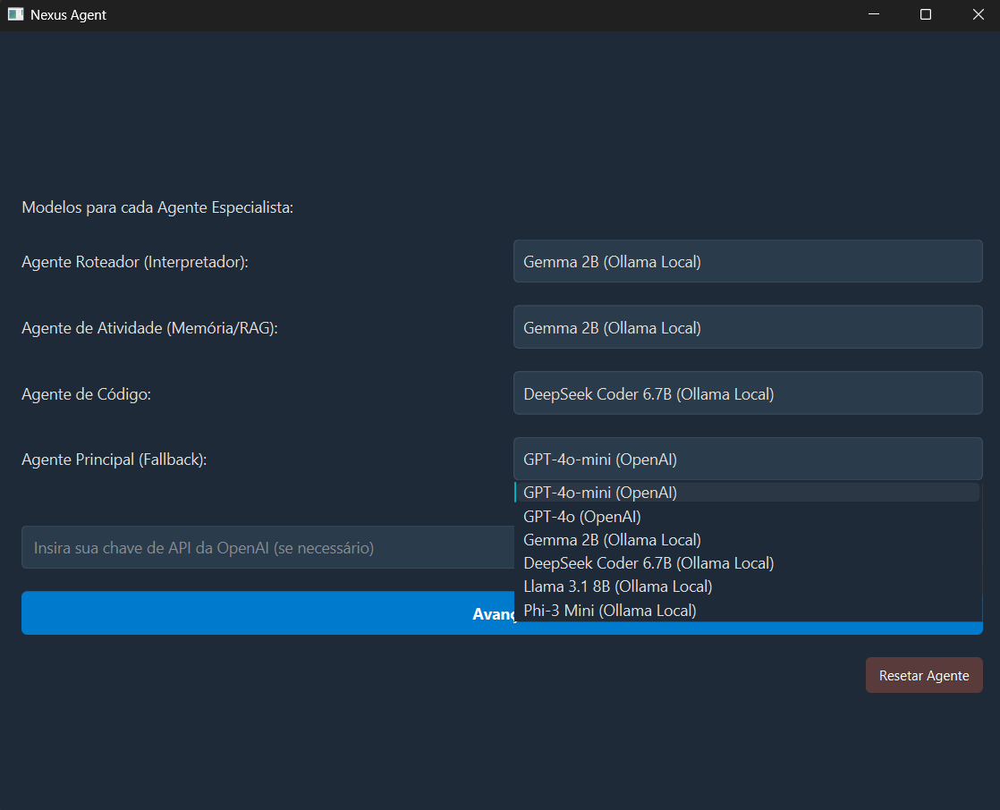
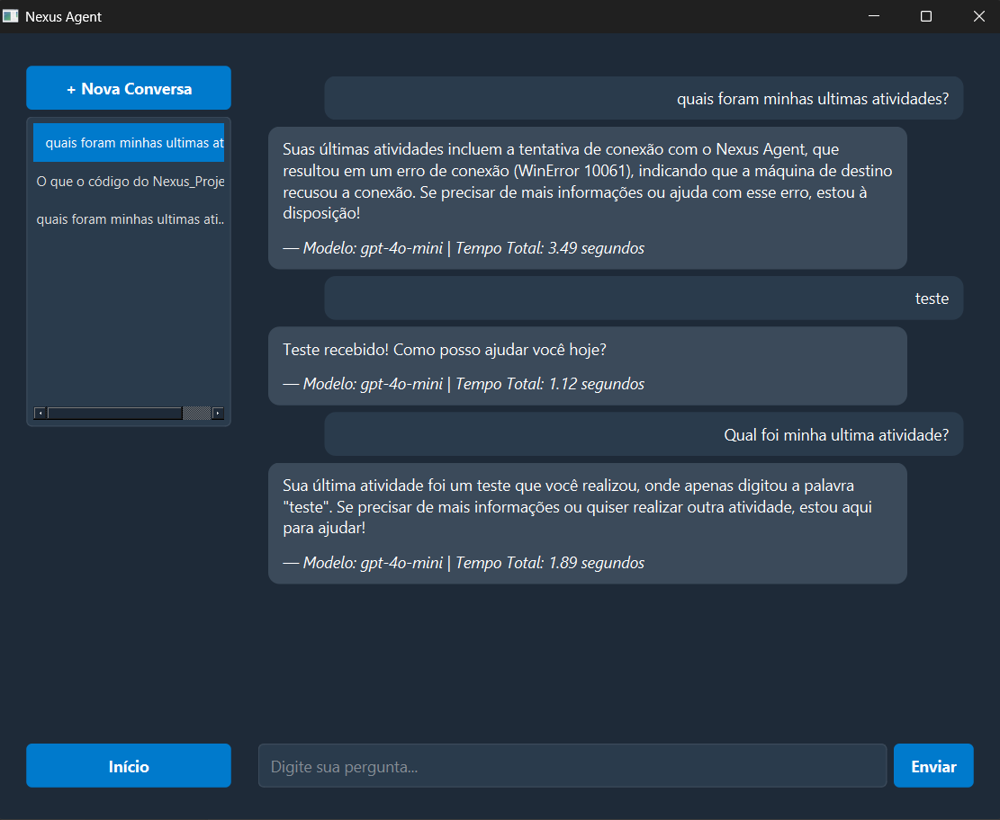
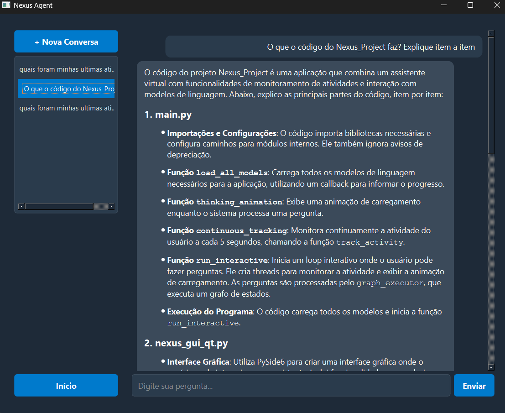

# Nexus: Um Agente Pessoal de Monitoramento Contextual de Atividades de Desenvolvimento com IA

#### Aluno: [Paulo Moura](https://github.com/paulofjm)

#### Orientadora: [Evelyn Batista](https://github.com/evysb)

---

Trabalho apresentado ao curso [BI MASTER](https://ica.ele.puc-rio.br/cursos/mba-bi-master/) como pré‑requisito para conclusão de curso e obtenção de crédito na disciplina "Projetos de Sistemas Inteligentes de Apoio à Decisão".

- [Link para o código](https://github.com/paulofjm/Nexus_Project_AI)

---

### Resumo

O **Nexus** é um sistema multiagente que monitora continuamente a estação de trabalho do desenvolvedor, coletando evidências de contexto como janelas ativas, capturas de tela, texto extraído via OCR, estatísticas de hardware e versões do código‑fonte para construir uma memória hierárquica consultável em tempo real. Utilizando embeddings *Sentence‑Transformers* e um índice vetorial FAISS organizado em camadas de curto, médio e longo prazo, o Nexus responde a perguntas em linguagem natural, sugere correções de código, executa ferramentas locais e registra insights do fluxo de trabalho. A orquestração é feita com **LangGraph**, permitindo roteamento dinâmico entre múltiplos LLMs (locais ou OpenAI) e ferramentas personalizadas. O resultado é um assistente que reduz perda de contexto, acelera troubleshooting e cria documentação viva do projeto.

### Abstract *(English)*

**Nexus** is a multi‑agent system that continuously monitors a developer’s workstation, capturing contextual evidence active windows, screenshots, OCR‑extracted text, hardware telemetry and live code snapshots to build a hierarchical, queryable memory in real time. Leveraging Sentence‑Transformers embeddings and a layered FAISS vector index, Nexus answers natural‑language questions, suggests code fixes, triggers local tools and logs workflow insights. **LangGraph** orchestrates dynamic routing among multiple LLMs (local or OpenAI) and custom tools. The result is an assistant that minimizes context loss, speeds up troubleshooting and generates living documentation of the project.

### 1. Introdução

Projetos de software modernos envolvem múltiplas janelas, IDEs, navegadores e documentação dispersa. Desenvolvedores perdem tempo alternando contextos e recuperando informações que já produziram. Paralelamente, LLMs despontaram como poderosos assistentes, mas carecem de contexto de execução local. O Nexus nasce para preencher essa lacuna: capturar a "memória operacional" do desenvolvedor e disponibilizá‑la a um agente conversacional capaz de responder perguntas contextuais, executar ações e evoluir com o uso.

### 2. Modelagem

- **Arquitetura de Módulos**: `core` (contexto e armazenamento), `models` (LLMs e embeddings), `nodes_graph` (LangGraph), `utils` (OCR, monitoramento, logs).
- **Monitoramento Contínuo**: *thread* que a cada 5 s verifica atividade relevante, captura telas, roda OCR (Tesseract/Donut/TroCR) e coleta métricas de CPU/RAM.
- **Versionamento de Código**: *watchdog* detecta alterações em arquivos `.py`, gera snapshot concatenado, calcula hash SHA‑256 e grava em `logs/code_versions/`.
- **Memória Hierárquica**: 20 registros → 1 bloco curto; 36 curtos → 1 médio; 50 médios → 1 longo; todos vetorizados no FAISS.
- **LangGraph RAG**: grafo de estados com nós para interpretação de intenção, consulta à memória, RAG de código, execução de ferramentas e fallback. O roteador escolhe entre modelos “Router”, “Activity” e “Code”.
- **Ferramentas Customizadas**: captura de screenshot, listagem de arquivos, abertura de programas, expansível via `nexus_tools_retriever`.

### 3. Resultados

# Estatísticas dos Testes (logs de 2026-02-01)

## 1. Metodologia de Análise

A análise a seguir foi conduzida correlacionando dados de múltiplos arquivos de log gerados pelo sistema Nexus em 2025-02-01. As principais fontes de dados foram:

- **monitor_log.json**: Para rastrear a sequência de execução dos nós do grafo, os modelos de linguagem (LLMs) utilizados em cada etapa e o tempo de inferência individual de cada chamada.
- **turns.json**: Para obter a pergunta exata do usuário e a resposta final gerada pelo agente, incluindo o tempo total de processamento reportado.
- **activity_raw_buffer.json**: Para extrair dados de utilização de recursos do sistema (CPU e memória) durante os períodos de teste.

A análise foca na explicação de um código python aberto no Visual Studio Code, para avaliar o desempenho dos diferentes LLMs configurados para os papéis de "Agente Roteador" e "Agente de Geração".

## 2. Hardware do ambiente de teste

- SSD: **1 TB**
- RAM total: **64 GB**
- CPU: os logs não registram modelo/núcleos/clock; somente **% de uso**.

## 3. Modelos testados (5 execuções)

Para todos os modelos foi realizada a mesma solicitação: "Explique o código que estou trabalhando no momento".

| Execução | Timestamp | Modelo | Tempo Total (s) |
|---|---|---|---|
| 1 | 2026-02-01T16:03:45 | `gpt-4o-mini` | 23.07 |
| 2 | 2026-02-01T15:19:11 | `deepseek-coder:6.7b-instruct` | 343.51 |
| 3 | 2026-02-01T15:25:58 | `llama3.1:8b` | 245.39 |
| 4 | 2026-02-01T15:33:59 | `phi3:mini` | 328.52 |
| 5 | 2026-02-01T16:06:26 | `gemma:2b` | 105.50 |


## 4. Estatísticas de latência (ponta-a-ponta)
Latência (Tempo Total, s, n=5)
| Métrica | Valor | 
|---|---| 
| min | 23.07 | 
| P25 | 105.50 | 
| mediana | 245.39 | 
| média | 209.20 | 
| P75 | 328.52 | 
| max | 343.51 |

## 5. Uso de CPU e memória (telemetria disponível)

Os dados do arquivo `activity_raw_buffer.json` indicam o seguinte sobre o uso de recursos do sistema durante os testes:

- Intervalo de telemetria: 2026-02-01T15:35:32.647098 → 2026-02-01T15:39:50.186487 | registros: 14 (válidos p/ CPU/RAM: 13)
- CPU (%): min 10.6 | mediana 37.8 | média 39.8 | pico 69.3
- RAM (%): min 53.4 | mediana 56.1 | média 55.8 | pico 56.4
- RAM (GB, total 64): min 34.2 | mediana 35.9 | média 35.7 | pico 36.1


## 6. Resultados e Recomendação Final

- **Modelos efetivamente testados (5):** `gpt-4o-mini`, `gemma:2b`, `llama3.1:8b`, `phi3:mini`, `deepseek-coder:6.7b-instruct`.

- **Desempenho real (Tempo Total por resposta, a partir dos logs):**
  - `gpt-4o-mini`: **23.07s** — melhor tempo do conjunto.
  - `gemma:2b`: **105.50s–114.44s** — Não conseguiu explicar o código, como solicitado.
  - `llama3.1:8b`: **245.39s** — lento, porém entregou uma explicação mais estruturada.
  - `phi3:mini`: **328.52s** — muito lento e tende a “inventar” solução (gera código/abordagem sem amarrar no contexto real).
  - `deepseek-coder:6.7b-instruct`: **343.51s** — o mais lento e resposta genérica (“boas práticas”), sem explicar o código de fato.


- **Criticidade do Agente Roteador (efeito dominó é real):**
  - Quando o roteamento falha, o resto vira ruído: modelo “bom” não compensa contexto errado.
  - Nos testes, `gemma:2b` mostrou comportamento inconsistente para o papel de roteamento: em vez de classificar/rotear de forma confiável, ele caiu em geração de conteúdo fora do esperado (ex.: despejo de código), o que quebra o pipeline.
  - `gpt-4o-mini` foi o único que entregou resposta coerente e estruturada com tempo bem menor dentro do conjunto logado.

- **Desempenho vs. viabilidade operacional (local vs API):**
  - Os modelos locais testados ficaram na faixa de **~1.7 a 5.7 minutos por resposta** (105s a 343s). Para um agente “conversando com o computador” isso é ruim: o usuário perde o timing da tarefa. Já via API a resposta foi obtida em 26 segundos, tempo aceitável para interação.


### Recomendação Final

1. **Fixar `gpt-4o-mini` como Agente Roteador padrão** (produção).  
   Motivo: é o componente mais crítico; com roteamento ruim, todo o resto perde valor. E ele foi o mais rápido no log.

2. **Usar modelo local apenas onde fizer sentido e não quebrar a experiência:**
   - Local para tarefas “não interativas” (batch, sumarização offline, compressão de memória, embeddings), não para resposta imediata ao usuário.
   - Para geração local “online”, é necessario reduzir latência (GPU/quantização agressiva/engine mais eficiente).
   


### 7. Demonstração da Interface do Nexus Agent

Abaixo estão algumas capturas de tela da interface desenvolvida, ilustrando como o usuário interage com o sistema:

*(Configuração Ilustrativa)*

### Tela – Configuração de Modelos


### Tela – Chat de Atividades


### Tela – Chat de Código



### 4. Conclusões

O Nexus comprova que a combinação de monitoramento local, memória vetorial hierárquica e orquestração de LLMs fornece ganho real de produtividade ao desenvolvedor, reduzindo a busca manual por contexto e acelerando a decisão. Futuras evoluções incluem: tradução de voz em tempo real, integração com IDEs, armazenamento criptografado e ajuste fino de modelos locais voltados a código.

---

Matrícula: 231.100.980

Pontifícia Universidade Católica do Rio de Janeiro

Curso de Pós‑Graduação *Business Intelligence Master*

\===============================================================================

## Requisitos

- **Python 3.9 ou superior**
- **Tesseract OCR** instalado e no `PATH`
- GPU NVIDIA opcional para aceleração (CUDA 11.8+)
- **Ollama** instalado e no `PATH` para modeslos locais (https://ollama.com/)


### Instalação do Tesseract

**Windows**

1. Baixe o instalador em: [https://github.com/UB-Mannheim/tesseract/wiki](https://github.com/UB-Mannheim/tesseract/wiki)
2. Durante a instalação marque **“Add to PATH”**.

**Linux (Ubuntu/Debian)**

```bash
sudo apt update
sudo apt install tesseract-ocr
```

### Instalação do projeto

```bash
git clone https://github.com/paulofjm/Nexus_project.git
cd Nexus_project
python -m venv env_nexus
source env_nexus/bin/activate # Windows: env_nexus\Scripts\activate
pip install -r requirements.txt
```

Crie um arquivo `.env` e defina pelo menos:

```env
LLM_MODE=local      # ou openai
OPENAI_API_KEY=sk-...
```

### Execução

```bash
python main.py
```

O script carregará os modelos configurados, iniciará o monitoramento em segundo plano e abrirá um prompt interativo.

Para redefinir a memória e logs use:

```bash
python reset_agent.py
```

---

> **Observação**: a utilização de modelos OpenAI pode gerar custos na sua conta. Certifique‑se de revisar as chaves e limites antes de executar em produção.


